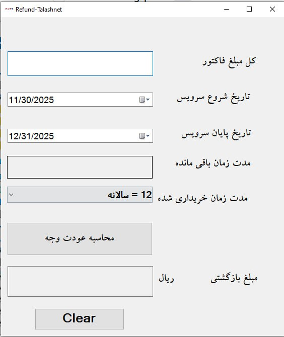

# 💰 برنامه بازگشت وجه (Refund) مخصوص هاستینگ های ایرانی

این برنامه با استفاده از Windows Forms و زبان #C طراحی شده تا مبلغ بازگشت وجه سرویس‌های هاستینگ را بر اساس مدت‌زمان استفاده‌شده محاسبه کند. در این محاسبه، 10٪ مالیات و 20٪ کارمزد از مبلغ اولیه کسر می‌شود.

  <picture>
    
  </picture>

---

## ✨ ویژگی‌ها

- محاسبه دقیق روزهای استفاده‌شده و باقی‌مانده
- پشتیبانی از پلن‌های مختلف: ماهانه، سه‌ماهه، شش‌ماهه و سالانه
- کسر خودکار مالیات و کارمزد از مبلغ قابل بازگشت
- رابط کاربری ساده و قابل استفاده برای کاربران عادی

---

## 🖥 نحوه استفاده

1. مبلغ پرداختی فاکتور را وارد کنید
2. نوع سرویس را از لیست انتخاب کنید (مثلاً سالانه، ماهانه و ...)
3. تاریخ شروع و پایان سرویس را مشخص کنید
4. روی دکمه "محاسبه" کلیک کنید تا مبلغ بازگشتی نمایش داده شود
5. برای پاک‌سازی اطلاعات روی "پاک‌سازی" کلیک کنید

---

## 📌 نکات فنی

- محاسبه مبلغ بازگشت به صورت زیر انجام می‌شود:
  - مبلغ نهایی = مبلغ اولیه / 1.1 (کسر مالیات) × 0.8 (کسر کارمزد)
  - سپس این مبلغ بر حسب تعداد روزهای باقی‌مانده تقسیم می‌شود

- محاسبات و کنترل خطاها در متد `CalculateRefund` انجام می‌شوند

---

## 🛠 تکنولوژی‌های استفاده‌شده

- زبان #C
- Windows Forms (.NET Framework)
- محیط توسعه Visual Studio

